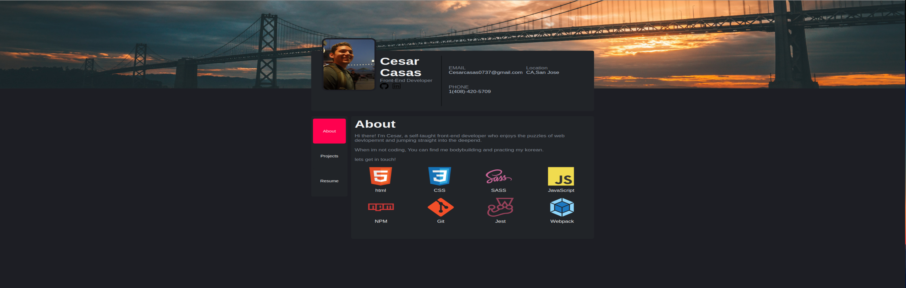

# personal-portfolio

# Personal Portfolio Website

Welcome to my personal portfolio website! This website showcases my web development projects and highlights my skills as a web developer. I have designed this portfolio with accessibility (WAI-ARIA), responsiveness (media queries), and dynamic content (DOM manipulation) in mind.

## Table of Contents
- [About](#about)
- [Projects](#projects)
- [Skills](#skills)
- [Technologies Used](#technologies-used)
- [Installation](#installation)

---

## About

This portfolio website is a representation of my journey as a web developer. It provides visitors with an overview of my background, showcases the projects I've worked on, and outlines the skills I've acquired along the way. The website is designed to be user-friendly, accessible, and responsive to various devices and screen sizes.

## Projects

Explore a selection of my web development projects in the [Projects](projects.md) section. Each project is accompanied by a description, screenshots, and links to the live demo and source code on GitHub.

## Skills

In the [Skills](skills.md) section, you'll find a comprehensive list of the web development skills I possess.I have experience in a wide range of technologies and tools.

## Technologies Used

- HTML5
- CSS3 (Media Queries)
- Sass (Seperate Code)
- JavaScript (DOM manipulation)
- Webpack (organizing JS files )
- Git (Version Control)

## Installation

If you'd like to run this portfolio website locally, follow these steps:

1. Clone the repository to your local machine:

